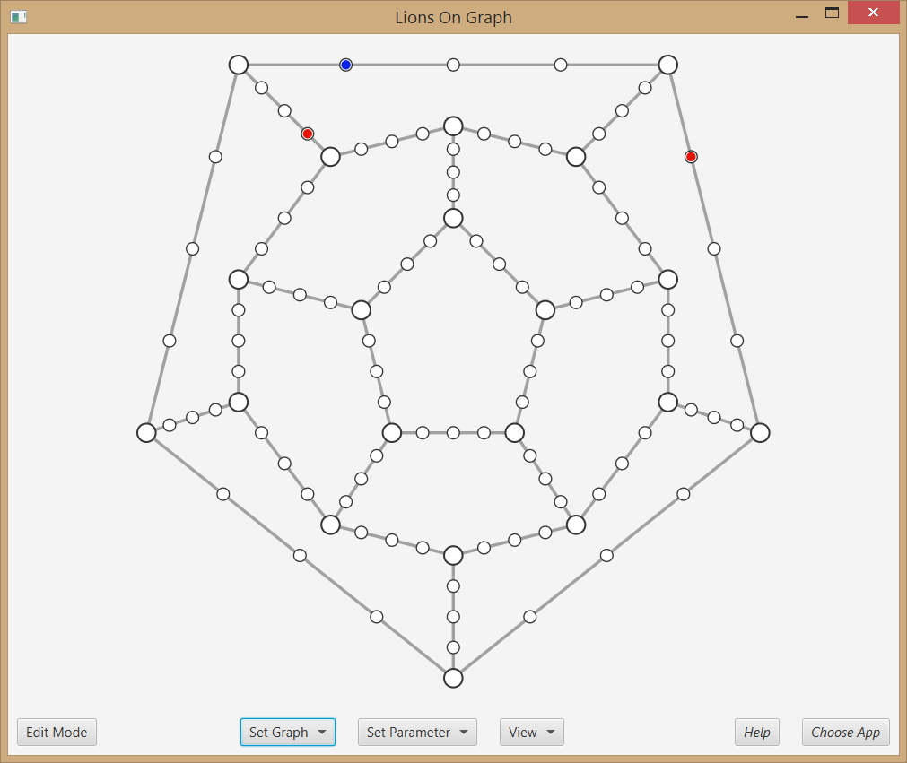
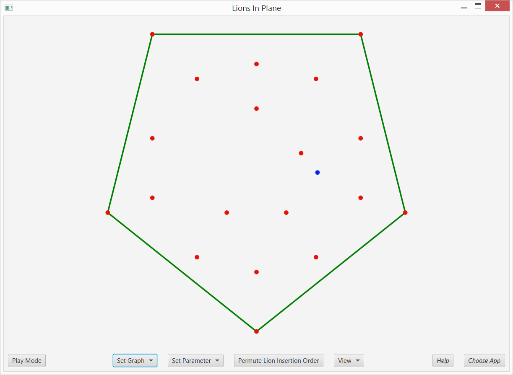

# Lab Project: Computational Geometry

This reposity stores the work for the Lab Projct: Computational Geometry in summer term 2016 for University of Bonn. The lab is a part of the master program in computer science.

We implemented and visualized algorithms for two different algorithmic problems, namely the Lions and Men problem on graphs and the Lions and Men problem in the infinite plane. In the Lions and Men problem, a number of lions try to catch a man in a given environment. The man tries to escape as long as possible, against any arbitrary lion strategy. The paper gives a special graph on which they show that in general a man can escape two lions. Mikkel Abrahamsen et. al. from University of Copenhagen published the paper "Best Laid Plans of Lions and Men", in which they present algorithms for both variants - special graph and plane - man strategies to escape always any lions. We implemented both of them and on top of these algorithms we implemented some lions strategies to visualize possible attacks on the man strategies. Our visualization aims to help understanding the behavior of the algorithms and is a tool to test out ideas for new algorithms.

The Java applet can be downloaded at [releases](https://github.com/drademacher/lab-computational-geometry/releases/latest). The applet visualizes the algorithm and is aimed to help understanding the algorithm behavior on various examples. These examples can be generated by random map generation or loading a map file from the repository. Any example can be modified to see how the algorithm reacts at different scenarios.

## Exemplary Screenshots of the GUI

The following screenshots show the user interface of the applet. The first screenshot shows the layout of the applet in the graph variant and the second screenshot show the applet in the infinite plane variant. Custom configurations are possible.

